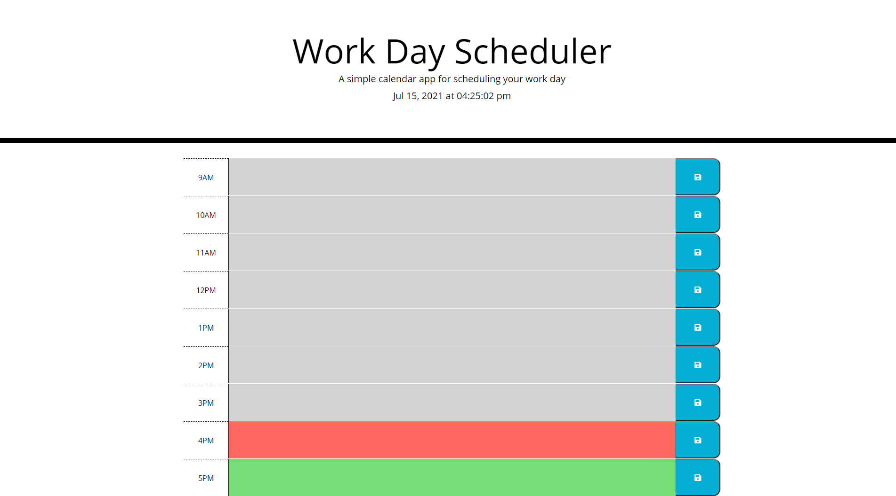

**What's the result of my work for this webpage?**  
I made a day planner using Javascript, jquery, and bootstrap. I also used the moment.js for the current date and time. 
The user is able to schedule, edit, and save any events they choose between 9am and 5pm. I color coded the planner based
on the time of day. Light grey is the past hours, red is the current hour, and green is the future hours.

**What did I learn from this assignment?**  
I learned how to use the moment function. This homework helped me build on the previous homework's lessons. I learned how 
to use a variety of functions and I used siblings and children elements in this homework.

**URLs for the Coding Challenge Quiz Website**  
<a href ="https://burkemm.github.io/Matt-Burkes-Day-Planner/">Matt Burke's Day Planner</a>  
<a href ="https://github.com/burkemm/Matt-Burkes-Day-Planner">Matt Burke's Day Planner Github Repository</a>

**What's the current webpage look like?**  

